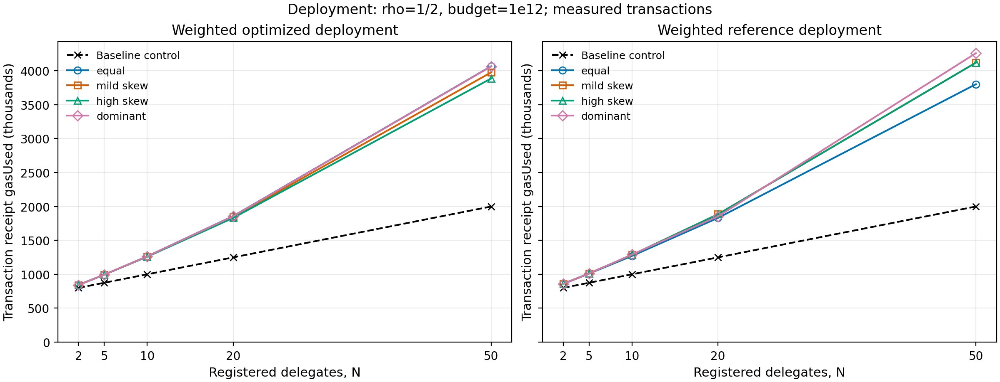
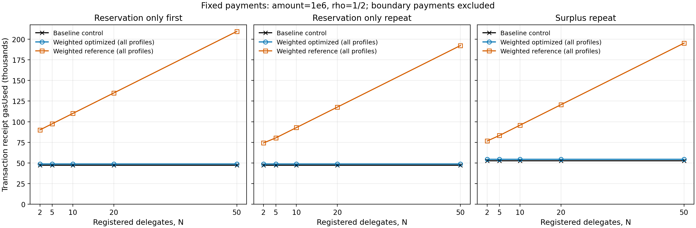

# Weighted Allocation Extension

## 1. Motivation and scope

SpendPartition divides a principal's per-window budget between protected reservations and shared surplus. The baseline divides the reserved portion approximately equally among registered delegates, with integer rounding resolved by registration order. Equal shares provide a useful default, but delegates can have different expected spending needs. An application with a high-volume purchasing delegate and a lower-volume maintenance delegate may want different protected capacities without abandoning the common budget or shared surplus.

The weighted extension makes that distinction configurable: reserved capacity is divided according to nonnegative integer weights supplied alongside the ordered delegate list. Weights express relative protected shares, not separate spending budgets. A delegate can still draw from the common surplus after exhausting its own reservation, while another delegate's protected capacity remains unavailable to it. The principal chooses the weights; the extension does not infer demand or optimize the allocation policy.

The baseline implementation, `src/SpendPartition.sol`, remains untouched. The extension is implemented separately as `SpendPartitionWeighted`, termed **weighted optimized** here, and preserves the observable baseline interface. Weighted allocation changes reservation construction, not the reservation-first debit semantics. Delegates and weights are fixed at construction, as are the budget, reservation ratio and window duration. There is no runtime reconfiguration mechanism. The principal architectural requirement is that payment work remain independent of registered delegate count, denoted by `N`.

## 2. Weighted reservation model

Let `B_G` be the total budget for a window and `rhoNum/rhoDen` the configured reservation ratio. The reserved portion `R`, shared surplus `S`, and delegate quotas are defined as follows, where `w_i` is delegate `i`'s weight:

```text
R = floor(B_G * rhoNum / rhoDen)
S = B_G - R
W = sum(w_i)
q_i = R * w_i / W
base_i = floor(q_i)
remainder_i = (R * w_i) mod W
```

Token accounting uses integer smallest units. Hamilton, or largest-remainder, allocation first gives every delegate `base_i`. It then computes `L = R - sum(base_i)` and awards one additional unit to each of the `L` largest remainders. Equal remainders are ordered by lower registration index. The final reservations `r_i` therefore sum exactly to `R`, with each reservation at the floor or ceiling of its exact quota. No floating-point arithmetic or further reservation remainder loss is introduced.

For `R=100` and weights `[1,2,3]`, the total weight is six. The floor allocations are `[16,33,50]`, summing to 99, and the remainder numerators are `[4,2,0]`. The one unassigned unit goes to the first delegate, producing `[17,33,50]`. The rule also reproduces baseline reservations for equal positive weights, including its registration-index rounding convention.

Individual zero weights are allowed and receive zero protected reservation, while registered zero-weight delegates can still spend available surplus. Total weight must be positive and fit in `uint256`; mismatched arrays and invalid baseline configuration are rejected. At `rho=0`, all capacity is surplus; at `rho=1`, all capacity is partitioned into reservations. Both implementations use `Math.mulDiv` for quota floors and `mulmod` for remainders, avoiding overflow-prone intermediate multiplication even when `R * w_i` cannot fit in `uint256`.

## 3. Optimized implementation

### Construction and storage

The weighted optimized constructor uses remainder-rank counting. For each delegate, it counts the delegates with a larger remainder, or an equal remainder and lower registration index. A rank below `L` receives an additional unit. This directly implements deterministic Hamilton ordering without changing the delegate order. The nested comparison loops perform O(N²) apportionment work during construction; final reservations are precomputed once rather than recalculated during payments.

The baseline derives equal reservations from a common base, remainder and delegate index. Heterogeneous reservations instead require an explicit runtime lookup. The weighted optimized mapping stores:

```solidity
struct AgentSlot {
    uint16 indexPlusOne;
    uint48 windowId;
    uint192 spent;
    uint192 reservation;
}
```

Membership/index, window tag and spending occupy one packed storage slot; reservation occupies a second slot. The inherited budget bound makes `uint192` sufficient for a reservation. Weights and temporary apportionment arrays are not retained in optimized runtime storage. The additional slot buys direct lookup of each delegate's fixed protected capacity at the cost of more deployment storage and a larger payment constant.

### Payment and window behavior

A payment reads the caller's reservation and effective spending for the current window. It debits the remaining own reservation first, then charges any excess to shared surplus. If available surplus cannot cover that excess, the whole call reverts. Accounting precedes the token transfer, and reentrancy protection prevents a registered delegate from entering a second payment during a transfer callback. Transfer failure rolls back accounting through transaction atomicity.

There is no sorting or delegate scan in the optimized payment path, making it O(1) with respect to `N` by architecture. Window tags provide lazy resets: old spending and surplus read as zero in a new window without clearing every historical slot. A successful payment updates the caller's current-window accounting; unused delegates need no physical reset.

During Iteration 1A, packed payment-state writes were coalesced by completing the checked spend conversion before assigning window and spending fields. The storage audit verifies one write to the packed agent slot on the measured reservation-only path and no reservation-slot write during the audited payments. Reservation remains fixed throughout `pay()`. This write-count evidence is distinct from the canonical receipt-based gas experiment; no development before/after gas saving is included in the performance comparison below.

## 4. Independent reference implementation

`SpendPartitionWeightedReference`, termed **weighted reference**, provides an independently structured verification fixture to reduce common-mode bugs during differential verification. Comparing two implementations is less informative if both reuse the same apportionment helper or state-transition code. The weighted reference neither inherits from nor calls the weighted optimized implementation and shares no weighted-allocation or state-transition helper with it. Audited arithmetic primitives are shared without duplicating unsafe arithmetic merely to create independence.

Its state uses plain delegate and reservation arrays, ordinary configuration storage, and spending mappings keyed by window and delegate. Membership/index lookup scans the delegate array linearly. Its Hamilton construction repeatedly selects the largest unawarded remainder, scanning in registration order and replacing the winner only for a strictly larger remainder. Each delegate can receive at most one leftover unit. This selection-style algorithm differs from optimized remainder-rank counting while implementing the same tie-break rule.

For payment accounting, the weighted reference derives surplus usage from the increase in spending above the stored reservation. A new window selects previously untouched window-keyed state rather than retagging packed slots. An ordinary storage guard provides independent reentrancy protection. These choices favor understandable oracle logic over runtime efficiency. The weighted reference is a verification fixture, not a production optimization target; slower payments are acceptable, and its constructor is not assumed to be universally more expensive.

## 5. Verification methodology

The verification layers address different failure modes. Known anchors establish intended rounding and error behavior; property fuzzing checks allocation consequences across randomized inputs; stateful campaigns test sequences of spending and window changes; differential testing compares independently implemented behavior. Full regression checks that the extension coexists with the accepted baseline workstream.

| Layer | Purpose | Evidence |
| --- | --- | --- |
| Deterministic scenarios | Known anchors and edge cases | 17 optimized scenarios + 20 reference anchors |
| Fuzz properties | Allocation properties P1–P6 | 1,000 runs/property; 6,000 executions |
| Stateful invariants | Spending safety I1–I5 | 5 configurations × 8,192 handler actions = 40,960 |
| Differential | Weighted optimized vs independent weighted reference | 5 configurations × 8,192 handler actions = 40,960 |
| Full regression | Whole repository | 110 tests passing |

Deterministic coverage includes equal, unequal and zero weights, registration-index ties, both rho endpoints, invalid configurations, and full-precision cases. Payment anchors also exercise reservation-first surplus charging, isolation, lazy resets, rejected-call atomicity, transfer failures and callbacks. The separate storage audit checks the packed-write behavior discussed above.

Property fuzzing tests the weighted optimized implementation against mathematical consequences rather than using the weighted reference or copying the production ranking algorithm. P1 checks exact reservation conservation; P2 checks quota floor/ceiling bounds with overflow-safe arithmetic; P3 compares equal-weight reservations with the untouched baseline; P4 checks deterministic redeployment; P5 checks zero reservations and zero-weight surplus spending; P6 checks own-weight monotonicity while keeping `R`, all other weights and registration order fixed. Inputs are constructed validly, with `N` bounded to 1–8, budgets and initial weights up to one million, and explicit zero-weight coverage. The fixed seed and 1,000 runs per property are retained. **No own-weight monotonicity counterexample was found in the tested fuzz domain.** This is empirical evidence, not a mathematical proof of general Hamilton monotonicity or stability under participant-set changes.

The stateful invariant harness maintains independent ghost spending from accepted payments and exercises payments, surplus exhaustion followed by protected payments, and time advances. I1 checks aggregate spending against `B_G`; I2 checks protected reservation isolation as a transition, including after another delegate consumes surplus; I3 checks surplus-cap safety; I4 derives exact surplus accounting as `sum(max(0, spent_i-r_i))`; I5 observes zero effective spending and surplus on entering a fresh window before the next successful write. Historical storage need not be erased.

Invariant and differential campaigns each use five configurations, each with five delegates, covering equal, skewed, zero-weight, `rho=0` and `rho=1` cases. Each configuration runs 64 sequences at depth 128, producing 8,192 handler actions. Contracts are sufficiently prefunded to avoid artificial liquidity failures. Sticky violation flags retain detected mismatches despite `fail_on_revert=false`; coverage checks require relevant successes and rollovers. Handler actions are the formal campaign-size unit and can contain multiple payment attempts.

Differential setup gives both implementations identical ordered inputs and deployment timestamps, with separate equivalent mock tokens. Payments compare success/revert outcomes, complete revert bytes, recipient and contract token deltas, per-delegate spending, surplus, current window, and reservation/configuration views. Rejected calls must preserve observable state. Warps compare effective window state before subsequent payments. Within the tested campaign, equivalence was established over the compared observable API/state, payment/revert outcomes, token effects and window semantics. **Raw storage equality was deliberately excluded because the implementations use different layouts. Event-stream equivalence was not separately tested.** The result therefore does not claim complete equivalence of every externally observable artifact.

## 6. Performance evaluation

### Measurement design

The accepted analysis validates 45 configurations and 225 transaction-receipt rows: five same-environment baseline controls, 20 weighted optimized configurations and 20 weighted reference configurations. It preserves 17 methodologically equivalent matches against the archived baseline evidence. Both complete sweeps reproduced identical gas values from fresh Anvil state. Measurements use receipt `gasUsed`, separate broadcast transactions, Foundry v1.8.4, Solidity 0.8.30, Prague, and optimizer settings of 200 runs.

The matrix uses `N={2,5,10,20,50}`, `rho=1/2`, budget `1e12`, a one-day window, and payer `N−1`. Four positive-weight profiles are frozen: equal weights of one; mild skew alternating one and two from index zero; high skew `w_i=i+1`; dominant weights of one except the last weight `100*N`. Each configuration measures deployment, first and repeat reservation-only payments, first boundary-straddling surplus, and subsequent surplus. The principal fixed-payment comparisons use amount `1e6` and equivalent accounting regimes.

### Deployment and profile sensitivity

Baseline deployment is nearly linear over the measured range, with fitted slope 24,971.532 gas/delegate and R² approximately 0.99999998. Weighted optimized deployment grows faster: at `N=50`, overhead versus baseline ranges from 94.40% to 103.44%, depending on profile. Quadratic fits describe the five optimized points much better than linear fits, consistent with constructor O(N²) remainder-rank counting. **A five-point quadratic fit does not prove asymptotic complexity.**

Weight shape affects constructor gas. At `N=50`, weighted optimized deployment spans 3,885,608–4,066,258 gas: a 180,650-gas spread, or 4.5187% of the four-profile mean. High skew is cheapest and equal is most expensive there. These measurements do not establish a causal explanation for individual profile differences. The weighted reference constructor was cheaper in three sampled cases: equal at `N=20`, equal at `N=50`, and dominant at `N=20`. No exact crossover point between sampled values is inferred.



*Figure 1. Receipt deployment gas versus registered delegate count. Separate panels show the weighted optimized and weighted reference profiles against the same baseline control. Both y-axes start at zero; the curves show measured points, without extrapolation.*

### Fixed payments and boundary payments

| Fixed-payment regime, amount `1e6` | Baseline gas | Weighted optimized gas | Additional gas | Overhead / baseline |
| --- | --- | --- | --- | --- |
| Reservation-only first | 47,123 | 48,865 | 1,742 | 3.6967% |
| Reservation-only repeat | 47,123 | 48,865 | 1,742 | 3.6967% |
| Surplus-repeat | 52,637 | 54,379 | 1,742 | 3.3095% |

Weighted optimized fixed-payment gas is exactly constant across all measured `N` values and all four profiles: both delegate-count and profile spreads are zero for each regime. This is **strong empirical evidence of hot-path flatness over the tested matrix**, consistent with the loop-free architecture. It does not establish identical absolute gas to baseline or prove O(1) for all possible implementations/configurations. The explicit reservation-slot read is an architectural difference, but the experiment does not isolate what fraction of the measured 1,742-gas overhead is caused specifically by that read.

Weighted reference fixed-payment cost increases approximately linearly with `N`, with fitted slopes around 2.47k–2.49k gas/delegate. Its linear lookup for payer `N−1` traverses the ordered delegate array. This structural explanation supports the scaling expectation without attributing every gas difference to a particular instruction.



*Figure 2. Equal-amount payment comparisons for reservation-only first, reservation-only repeat and surplus-repeat regimes. Weighted profiles overlap exactly within each implementation. The weighted optimized path has a higher constant cost than baseline, while weighted reference cost increases with N. Variable-amount boundary payments are excluded.*

Boundary payments use remaining reservation plus one after the two reservation-only payments. Every such transaction consumes exactly one surplus unit, but amounts vary substantially across configurations. Weighted optimized boundary gas ranges from 71,553 to 71,565. The small difference is retained rather than labelled exact constancy; this path is not primary evidence for fixed-payment flatness.

The accepted hypothesis verdicts are **SUPPORTED** for H1, faster weighted optimized deployment growth; H3, flat optimized payments with `N`; H4, constructor sensitivity to weight shape; and H5, increasing weighted reference payment cost. H2 is **PARTIALLY SUPPORTED**: higher constant weighted payment cost is measured, but its cause specifically attributable to the reservation read is not isolated. These verdicts apply to the measured domain.

## 7. Limitations and trade-offs

Precomputation moves apportionment cost to deployment and adds reservation storage. It preserves predictable delegate-count-independent payment work, but does not make large delegate sets cheap to deploy or establish feasibility at arbitrary `N`. Configuration immutability also excludes adaptive weights, delegate additions and protected-capacity redistribution within a deployed contract.

Changing the participant set can alter existing Hamilton allocations even when a delegate's own weight is unchanged. Hamilton apportionment is known to have participant/population-style instability; participant-set stability is not guaranteed. [external citation to Hamilton/apportionment literature required during final report integration] This is distinct from the fixed-participant own-weight experiment in P6. Delegate/weight configuration is immutable after deployment, so such reconfiguration is outside current contract semantics.

Gas conclusions are bounded to five `N` values, four deterministic positive-weight profiles, `rho=1/2`, one budget/window, payer `N−1`, one mock token environment, and local Prague/Anvil measurements. They do not establish gas behavior for zero weights, rho endpoints, other payer indices or token implementations. Two identical deterministic runs establish repeatability, not statistical confidence intervals. Curve fitting supports architectural expectations rather than proving complexity. Correctness campaigns cover broader cases, but remain bounded testing; P6 is empirical evidence and the weighted reference remains a verification fixture rather than a deployment optimization target.

**Reproducibility note.** The measured contract-source revision is `a8ebb2702e31b9c37722b17e2a9ab7653ee40058`; `eb56c2c5d61f303f25ad38a463c3f91af9b23d68` committed the benchmark harness and canonical results; the accepted analysis commit base is `ff2dde1c7afe243f6104c75e8bcdc92d6a32da11`. The environment manifest records the earlier source revision because it was checked out when measurements were produced. The canonical [analysis memo](../../results/weighted_gas_analysis.md), [derived metrics](../../results/weighted_gas_analysis.csv), [environment](../../results/weighted_gas_environment.json) and [reproducibility record](../../results/weighted_gas_reproducibility.json) retain the evidence and chronology.

## 8. Contribution summary

The weighted extension generalizes equal reservations to deterministic Hamilton-weighted reservations while preserving reservation-first spending and a delegate-count-independent optimized payment path. Correctness is supported by deterministic anchors, property fuzzing, stateful invariants and differential testing against an independently structured weighted reference. The measured trade-off is primarily constructor cost: deployment grows faster with `N`, whereas fixed weighted optimized payments add 1,742 gas over baseline and remain exactly flat across the tested delegate-count/profile matrix. The contribution establishes this implementation and bounded evidence for team integration, with explicit limits on monotonicity, differential equivalence and performance claims.
